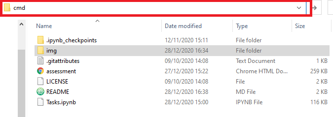
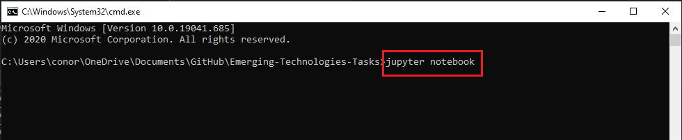
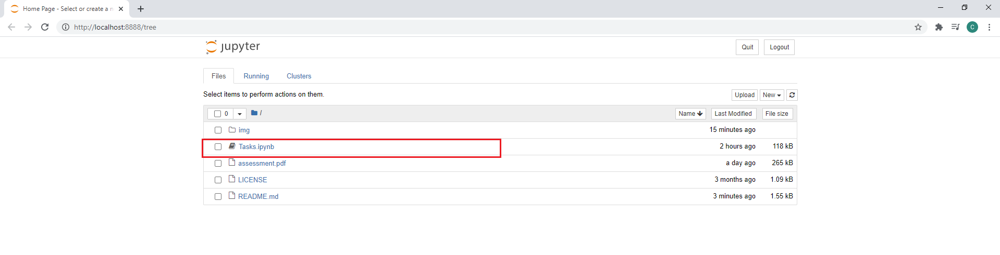
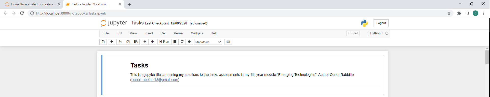
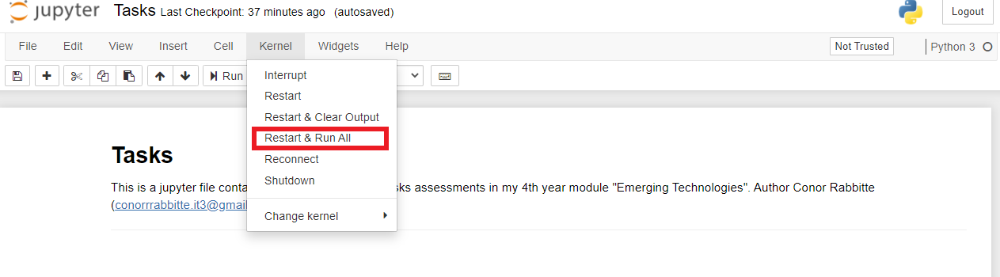
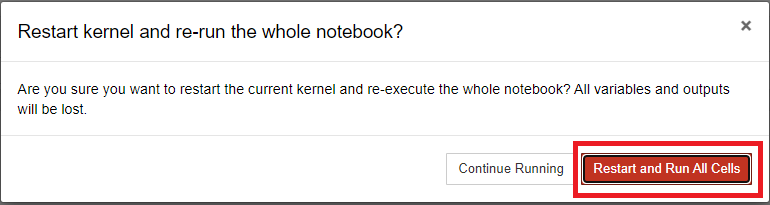

# Wind-Turbine-Power-Production
This git-repo is home to a power production predicting model for wind turbines programmed in python. The project is run using Docker and machine learning software from tensorflow and keras

## Running the Program

Clone the git-repo to your computer and you should have the following folder structure.

Next open up a command prompt in this folder. The easiest way to do this is to click on the folder path and type 'cmd' and hit the enter key, as seen below

Following this the command terminal will open in the repos folder path. Then type into the command terminal 'jupyter notebook' and hit the enter key.

This will open up the Jupyter Notebook program in your default browser. Click on the item 'Tasks.ipynb' as seen below.

This will open a new tab in your browser with the Tasks assignment running in Jupyter Notebook.

Now click on the tab 'Kernel' and in the dropdown menu select the 'Restart & Run All' option. This will restart the program and run each line sequentially.

You are now ready to use the Tasks program. You can read through and even edit, if you wish, the Markdown and/or Python cells.

## License & Copyright

© Conor Rabbitte, Galway-Mayo Institute Technology Software Development
